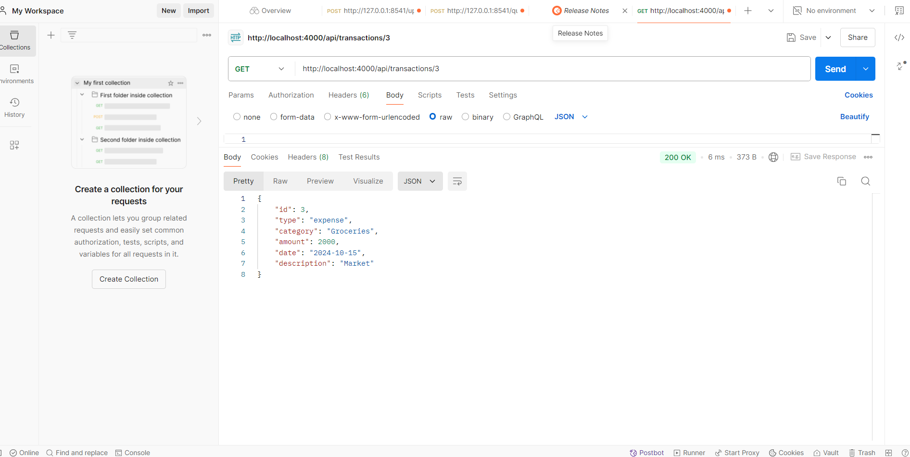

# Personal Expense Tracker API

This is a backend application built with **Node.js** and **SQLite** that helps users track their income and expenses. Users can add, update, delete, and retrieve transactions, and generate summaries of their financial activities.

## Features
- Add transactions (both income and expenses).
- Retrieve, update, and delete transactions.
- Get a financial summary (total income, total expenses, and balance).

---

## Prerequisites

- **Node.js** installed on your machine. You can download it from [Node.js Official Site](https://nodejs.org/).
- **SQLite**: No need for additional installation; the `sqlite3` library will handle it for you.

---

## Setup Instructions

**Clone the repository:**

   - git clone <https://github.com/balajisadanala/expensetracker.git>
   - cd expensetracker
   - npm install
   - node index.js
   - http://localhost:4000/api

**API Documentation**
1. Add a New Transaction
Endpoint: POST /api/transactions

- Request Body:

    {
    "type": "income",
    "category": "Salary",
    "amount": 43000,
    "date": "2024-10-01",
    "description": "September Salary"
    }

- Response:

    {
    "id": 1
    }

  - 

2. Add another Transaction
Endpoint: POST /api/transactions

- Request Body:

    {
    "type": "expense",
    "category": "Groceries",
    "amount": 5000,
    "date": "2024-10-12",
    "description": "Expense"
    }

- Response:

    {
    "id": 2
    }
- 
3. Add another Transaction
Endpoint: POST /api/transactions

- Request Body:

    {
    "type": "expense",
    "category": "Groceries",
    "amount": 2000,
    "date": "2024-10-15",
    "description": "Market"
    }

- Response:

    {
    "id": 3
    }
- 
4. Retrieve All Transactions
- Endpoint: GET /api/transactions

- Response:

  [
  {
    "id": 1,
    "type": "income",
    "category": "Salary",
    "amount": 43000,
    "date": "2024-10-01",
    "description": "September Salary"
  },
  {
    "id": 2,
    "type": "expense",
    "category": "Groceries",
    "amount": 5000,
    "date": "2024-10-12",
    "description": "Expense"
    }
    {
    "id": 3,
    "type": "expense",
    "category": "Groceries",
    "amount": 2000,
    "date": "2024-10-15",
    "description": "Market"
    }
]
- 
5. Retrieve a Transaction by ID
- Endpoint: GET /api/transactions/:id
- Example: GET /api/transactions/3
- Response:

{
    "id": 3,
    "type": "expense",
    "category": "Groceries",
    "amount": 2000,
    "date": "2024-10-15",
    "description": "Market"
    }
 - 
6. Update a Transaction, change first transaction date
- Endpoint: PUT /api/transactions/:id
- Example: PUT /api/transactions/1
- Request Body:

{
    "type": "income",
    "category": "Salary",
    "amount": 43000,
    "date": "2024-10-02",
    "description": "September Salary"
  },
- Response:

{
  "message": "Transaction updated successfully"
}
- 
7. Delete a Transaction
- Endpoint: DELETE /api/transactions/:id
- Example: DELETE /api/transactions/3
- Response:
-

{
  "message": "Transaction deleted successfully"
}
- 
8. Get Summary
- Endpoint: GET /api/summary
- Query Parameters (Optional):
- startDate – Example: 2024-10-01
- endDate – Example: 2024-10-23
- category – Example: Salary
- Response:

{
  "income": 43000,
  "expense": 5000,
  "balance": 38000
}

- 
**Error Handling**
- Error Response Format:

{
  "error": "Transaction not found"
}
Common Status Codes:
- 200 OK: Request was successful.
- 201 Created: Resource created successfully.
- 400 Bad Request: Invalid input or missing fields.
- 404 Not Found: Resource not found (e.g., invalid transaction ID).
- 500 Internal Server Error: Unexpected server issues.
